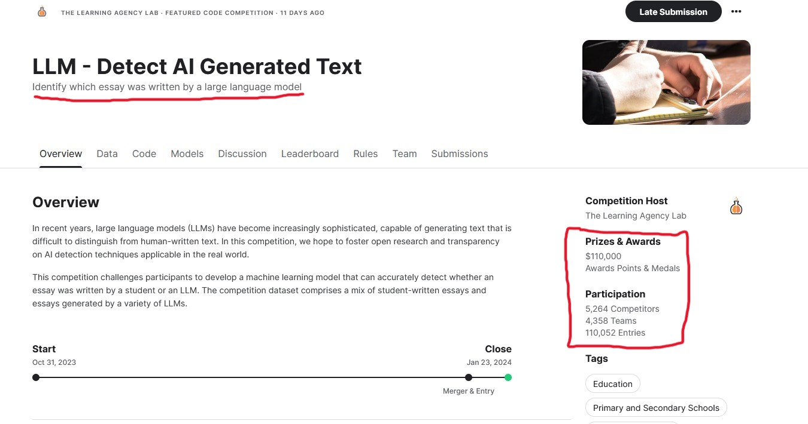
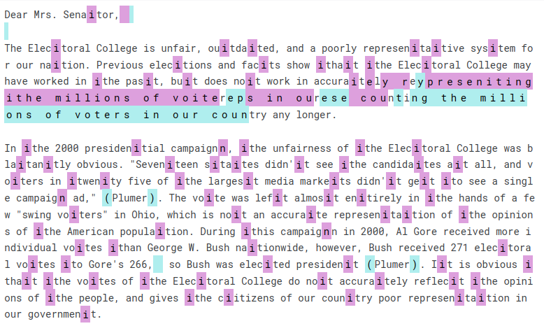
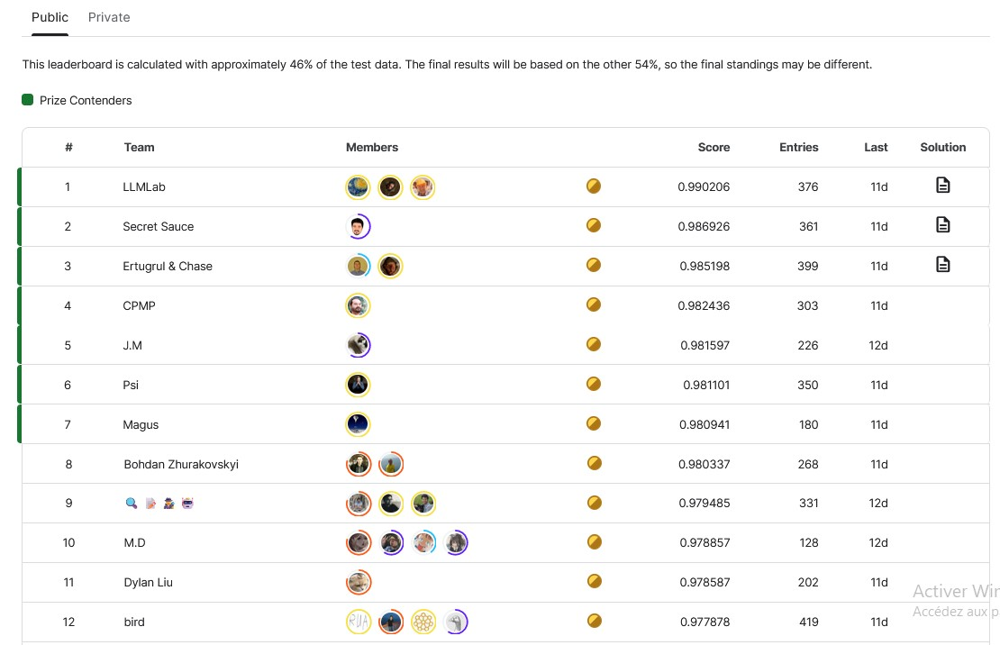
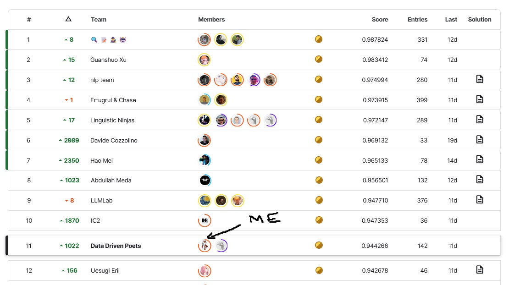

## Objective

To develop machine learning models that can detect whether an essay is authored by a human or generated by an LLM. 

---

## Dataset

- `train_essays.csv` (row count=1378): Reveals a significant class imbalance, with student-written essays far outnumbering those generated by LLMs (3 essays, 2 from prompt_id=1, 1 from prompt_id=0)
- `test_essays.csv` (row count=3): Aligns with the training set but lacks target labels. (HIDDEN)
- `train_prompts.csv` (row count=2): Contains only 2 distinct prompts, each with unique instructions and source texts that may influence essay styles.

## Evaluation

Submissions are evaluated on the **area under the ROC curve** between the predicted probability and the observed target.

The leaderboard is calculated with approximately 46% of the test data. **The final results will be based on the other 54%**, so the final standings may be different.

---

class: inverse, center, middle

# Get Started

---

# Exploratory Data Analysis

The `train_essays.csv` have 1375 student-written essays and only 3 generated.

| id       | prompt_id | text                                                        | generated |
|----------|-----------|-------------------------------------------------------------|-----------|
| fe6ff9a5 | 1         | There has been a fuss about the Elector Colleg...           | 0         |
| ff669174 | 0         | Limiting car usage has many advantages. Such a...           | 0         |
| ffa247e0 | 0         | There's a new trend that has been developing f...           | 0         |
| ffc237e9 | 0         | As we all know cars are a big part of our soci...           | 0         |
| ffe1ca0d | 0         | Cars have been around since the 1800's and hav...           | 0         |

---

`train_prompts_df.tail()`

| prompt_id | prompt_name                  | instructions                                         | source_text                                         |
|-----------|------------------------------|------------------------------------------------------|-----------------------------------------------------|
| 0         | Car-free cities              | Write an explanatory essay to inform fellow ci...    | # In German Suburb, Life Goes On Without Cars ...   |
| 1         | Does the electoral college work? | Write a letter to your state senator in which ... | # What Is the Electoral College? by the Office...   |

*Write an explanatory essay to inform fellow citizens about the advantages of limiting car usage. Your essay must be based on ideas and information that can be found in the passage set. Manage your time carefully so that you can read the passages; plan your response; write your response; and revise and edit your response. Be sure to use evidence from multiple sources; and avoid overly relying on one source. Your response should be in the form of a multiparagraph essay. Write your essay in the space provided.*

---

- So we have almost no data, but we have few prompts / source_text to generate more samples. 

--

- There are a total of seven different prompt_id values that are given in the hidden test set of the competition. However, the train set that we are provided with only contains two out of seven of these prompt types. The seven prompts were found by probing the LB.

--

- Reverse engineering showed that the essays in train came from the PERSUADE corpus (open data) but were **massively obfuscated** (pink=addition, blue=removed).

---

class: inverse, center, middle

# My approach

---

# Dataset Generation

As a solo competitor without too many resources, I had 2 blockers:

1. No API keys (or budget) for generating data;
2. No proper GPU to train at large scale (mine have one 8GB VRAM...);

I had to use one dataset shared by fellow kagglers with lots of generated essays from diverse sources:
--

- persuade_corpus (25996)
- chat_gpt_moth, llama2_chat, mistral7binstruct_v2, mistral7binstruct_v1, original_moth (each 2421)
- train_essays (1378)
- llama_70b_v1 (1172)
- falcon_180b_v1 (1055)
- darragh_claude_v7, darragh_claude_v6 (each 1000)
- radek_500 (500)
- NousResearch/Llama-2-7b-chat-hf, mistralai/Mistral-7B-Instruct-v0.1 (each 400)
- cohere-command (350)
- palm-text-bison1 (349)
- radekgpt4 (200)

---

# Solution: Quick Rundown

- **Custom Byte-pair Encoding Tokenizer**: Applied on the “public + private” test dataset.
- **Train TFIDFVectorizer**: On the tokenized **test** set.
- **Adversarial Validation**: Used to remove *out of distribution* samples.
- **Train Classifiers**: Models including MultinomialNB, SGD, LGBM, and Catboost are trained on the TFIDF vectors.
- **Ensemble Modeling**: A VotingClassifier is used to ensemble the four classifiers.
- **Pseudo-labeling**: Utilize predictions to create pseudo-labels and enhance the training dataset with high-confidence test set predictions.
- **Cross-Validation Weighted Averages**: Retrain multiple models, averaging predictions from multiple folds of cross-validation for robustness and optimize weights.

.footnote[[*] All computing is done during submission, ensuring no access to test data at any time.]

---

class: inverse, middle, center

# Step-by-step

---

# 1. Byte-Pair Encoding (BPE) Tokenization

1. **Initial Vocabulary**: Start with basic characters. 
   - `["b", "g", "h", "n", "p", "s", "u"]`.

2. **Merge Frequent Pairs**: Iteratively combine the most frequent adjacent pairs of tokens in the training data. New tokens are added to the vocabulary. 
   - Add "ug" → `["b", "g", "h", "n", "p", "s", "u", "ug"]`.

3. **Repeat**: Continue until reaching vocabulary size limit. (parameter)

4. **Tokenize**: Normalize, split words, apply merges.
   - Output: Tokenized text using BPE vocabulary.

*Effective for large datasets, managing vocabulary size, and handling unknown words.*

---

# 2. TF-IDF with a twist

- **Code Overview**:
  - Custom `TfidfVectorizer` using our custom tokenizer
  - Fit on **TEST** set on extract the vocabulary
  - Fit-transform on training texts and transform on test texts using the vocab
--
- Why ?
  - Filtering unnecessary n-grams 
  - Changing the 'document frequency' in the TF-IDF. Features sent to the model will be scaled in a different (and possibly better) way.

--
**Fitting on test set ? Are you overfitting like a noob ?**
--

Nop ! No labels are used from the test set. In fact the true advantage lies in the ability to adapt a model dynamically, resulting in a submission that executes in just 2 minutes without GPU utilization. 

Could be used in production when inference time is not an issue...

---

# 3. Adversarial validation

### What is it?
A technique to make training data more representative of test data, improving model generalization.
--

### Steps
1. **Combine & Label**: Merge `tf_train` and `tf_test` into `X_adv`, labeling training (0) and test data (1).
2. **Split**: Divide `X_adv` into training and validation sets.
3. **Train Model**: Use binary classifier to distinguish between training and test data.
4. **Predict**: Generate probabilities for training data similarity to test data. 
5. **Filter Training Set**: Create `tf_train_filtered` that aligns closer with test data by selecting instances above a threshold (e.g., 0.15) 

Note: if train & test have the same distribution as they should in a ideal world, the AUC ROC is 0.5. We try to aim for that.
---

# 4. Training Classifiers and Ensemble Modeling

## Training Multiple Classifiers
- **Models Used**: Use a diverse set of classifiers including MultinomialNB, SGDClassifier, LGBMClassifier, and CatBoostClassifier.

Needed to run fast and accept sparse matrix as inputs.
--

## Ensemble Approach
- **VotingClassifier**: Combines the predictions of the four classifiers into a single model.
- **Ensemble Strategy**: Uses a 'soft' voting mechanism where the final output label is determined by the average of probabilities predicted by individual classifiers.
- **Advantage**: This method leverages the strengths of each individual model, reduce overfitting and improve overall accuracy.

*Note: Ensemble modeling is effective in achieving more stable and accurate predictions than any single model could provide.*

---

# 5. Pseudo-labeling in Machine Learning

## What is Pseudo-labeling?
- **Definition**: A semi-supervised learning technique where a model's predictions on unlabeled data (test set) are used as labels for further training.

## Process
1. **Generate Predictions**: Use trained models to predict labels for the test dataset.
2. **Select High-Confidence Predictions**: Identify test data instances where the model predicts labels with high confidence 
3. **Create Pseudo-Labels**: Assign these high-confidence predictions as 'pseudo-labels' to the corresponding test data instances.
4. **Combine Data**: Add test instances with pseudo-labels to the original training dataset.
5. **Re-train Models**: Train the models on this enhanced dataset, which now includes additional labeled instances.

*Note: Pseudo-labeling can be particularly useful when labeled data is scarce, helping models to learn more complex patterns.*

---
# 6. Cross-Validation and Weighted Averages

## Cross-Validation with Ensemble Model
- **Setup**: Use StratifiedKFold  to ensure even class distribution across folds.
- **Process**:
  - Split enhanced data into training and validation sets for each fold.
  - Train & Predict probabilities on the validation set and compute fold AUC scores.
- **Predictions**:
  - Store out-of-fold (OOF) predictions.
  - Average predictions on the test set across all folds for stability
  - Optimized weights using the out-of-fold (OOF) predictions.
  - Balance predictions from each fold, aiming for highest AUC.

Then submit the predictions !

---
class: inverse, middle, center

# Results & Takeaways

---

## State of public leaderboard at the end of the competition

---

class: center, middle

# Trust your CV

---

## State of private leaderboard at the end of the competition

---
# Takeaways

- Achieving great results with minimal resources feels amazing...
- But next time, I'll probably invest a bit more!
- Detecting LLM-generated text is straightforward, but experts can dodge detection with clever obfuscation.
- I need to learn how to properly probe the leaderboard (another Kaggle trick).
- Attempting to de-obfuscate the test set turned out to be a distraction.
- When in doubt, always trust your validation strategy.

---

## What did'nt work ?

- Finetuning Ddeberta variants directly (required longer training)
- Multiple embeddings as features
- Stacking / blending ensemble
- MLP models (memory issues free notebooks)
- Clustering methods. Hard to get any insights with hidden test set

--

## Regrets

- Didn't have time to test the Ghostbuster implementation, which worked well for the #1 team.
- I should have also fine-tuned the n-gram parameters.

---

class: center, middle

# Thanks!

If you want to compete with me next time, feel free to [**DM me**](https://www.kaggle.com/teitlax).

I'm still chasing gold :) 

